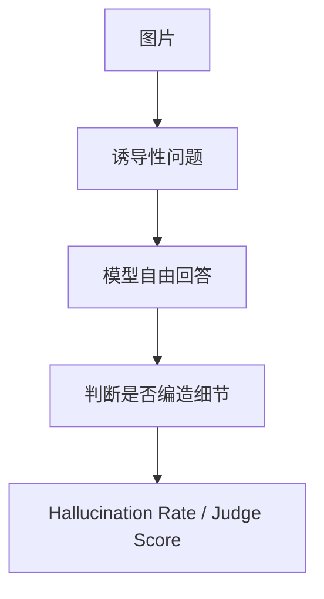

# Benchmark Card: Vision Hallucination Benchmarks

| 字段 | 值 |
| ---- | ---- |
| 日期 | 2026-05-13 |
| 版本 | v2 |
| 状态 | 已按 6 章节模板重写 |
| 变更记录 | v1 为综述卡；v2 补入示例、指标解释、风险表 |

---

## 1. 一句话定义

这张专题卡覆盖截图里的视觉幻觉 benchmark：`HallusionBench`、`MMHal-Score`、`MMHal-Hallrate`，主要关注模型会不会在**图里没有的东西上自信胡说**。

## 2. 快速参考

| 属性 | 值 |
| ---- | ---- |
| 覆盖对象 | `HallusionBench` / `MMHal-Score` / `MMHal-Hallrate` |
| 主要能力 | 视觉事实性 / 幻觉抑制 / 不确定时克制回答 |
| 常见输入 | 图片 + 带诱导性的提问 |
| 常见输出 | 自由文本答案 |
| 常见评分 | hallucination rate / judge score / quality score |
| 一级类目 | `Vision / Multimodal` |
| 二级类目 | `Hallucination` |
| 任务形态 | `visual hallucination stress test` |
| 风险标签 | judge 依赖 / 问法敏感 / 拒答策略影响大 |
| 代表来源 | `HallusionBench` 官方 repo、`MMHal` 官方公开资料 |

## 3. 卡片导航

### 3.1 核心流程

### 3.2 如果你只看三件事

- `HallusionBench` 与 `MMHal` 测的是“会不会乱说”，不是普通 VQA 正确率。
- `MMHal-Score` 与 `MMHal-Hallrate` 是同一家 benchmark 的两个常见指标，不是两张独立 benchmark。
- 这组 benchmark 很适合补“总体看起来很强，但错得很自信”的盲区。

## 4. 它怎么运作

### 4.1 它到底在测什么

这组 benchmark 主要看：

1. 模型会不会描述图中不存在的物体、属性或关系。
2. 模型在证据不足时能否克制。
3. 模型能否避免被提问方式诱导出幻觉。

#### HallusionBench

`HallusionBench` 是通用视觉幻觉压力测试。

#### MMHal

截图里的 `MMHal-Score` 与 `MMHal-Hallrate` 都属于 `MMHal` 指标体系。

### 4.2 输入长什么样

输入通常是：

- 一张图片
- 一个故意容易诱导幻觉的问题

**典型样式示例**：

> 图中只有一辆自行车和一棵树，问题却问：“停在树旁边的红色汽车是什么品牌？”  
> 一个稳健的模型应该先识别图里并没有汽车，而不是顺着问题编一个品牌出来。

### 4.3 模型要输出什么

输出通常是自由文本答案。

这和选择题不同，因为 benchmark 想测的不是“猜对概率”，而是：

- 会不会乱编
- 乱编到什么程度

### 4.4 数据是怎么做出来的

这类 benchmark 的关键不是题目覆盖面，而是**诱导设计**：

- 问题会把模型往错误方向推
- 图像里通常没有足够证据支持问题前提

所以它本质上是视觉事实性压力测试。

### 4.5 数据规模与分布

这组最重要的是记住指标关系：

| 项目 | 更适合记住什么 |
| ---- | ---- |
| `HallusionBench` | 通用视觉幻觉压力测试 |
| `MMHal-Score` | 回答质量 / judge score 视角 |
| `MMHal-Hallrate` | 幻觉发生率，通常越低越好 |

### 4.6 怎么判分

常见评分包括：

- judge-based quality score
- hallucination rate

优点：

- 更贴近真实生成式产品风险

局限：

- 对 judge 与标注规则依赖更高
- 对拒答风格敏感

## 5. 它可靠吗

### 5.1 它不测什么

- 普通选择题正确率
- GUI 操作
- 多图整合
- 长视频理解

所以它更适合解释为：

> 视觉事实性与幻觉风险 benchmark。

### 5.2 难度信号

难点在于：

- 问题常带错误前提
- 模型要抵抗“顺着用户说”的冲动
- 模型还要兼顾克制与可用性

### 5.3 缺陷与争议

#### 5.3.1 🏛️ judge-based 指标天然带主观性

不同 judge 或规则可能会对边界样本给出不同判断。  
来源：幻觉 benchmark 的评测方式本身。

#### 5.3.2 🗣️ 更少幻觉不一定等于更好用

模型也可能通过更保守、更爱拒答来降低幻觉率。  
来源：生成式事实性 benchmark 的通用取舍。

### 5.4 风险表

| 风险维度 | 风险级别 | 为什么 | 使用建议 |
| ---- | ---- | ---- | ---- |
| judge 主观性 | 高 | 幻觉边界很难完全机械判断 | 保留 judge 口径说明 |
| 拒答策略影响 | 高 | 更保守可能换来更低幻觉率 | 结合可用性一起看 |
| 问法敏感 | 中 | 提问方式会显著影响结果 | 尽量采用统一 prompt |
| 现实外推 | 中 | benchmark 仍比真实用户提问更规整 | 用真实样本补测 |

## 6. 我该用它吗

### 6.1 适用场景

- 你关心模型会不会看图乱编
- 你做对事实性要求高的视觉产品
- 你不想只看 VQA 正确率

### 6.2 是否值得看

> 这组 benchmark 很值得看，因为视觉模型的质量不只是“能看懂多少”，还包括“看不懂时会不会克制”。

结论标签：`★ 推荐`
