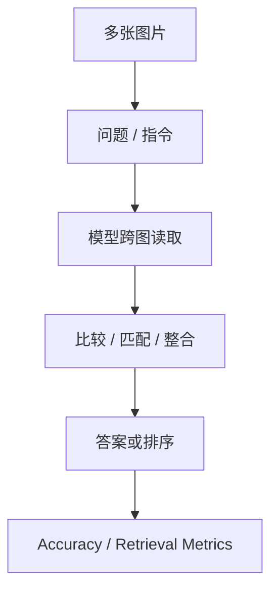

# Benchmark Card: Vision Multi-Image Benchmarks

| 字段 | 值 |
| ---- | ---- |
| 日期 | 2026-05-13 |
| 版本 | v2 |
| 状态 | 已按 6 章节模板重写 |
| 变更记录 | v1 为综述卡；v2 补入示例、风险表与章节展开 |

---

## 1. 一句话定义

这张专题卡覆盖截图里的多图 benchmark：`BLINK`、`MUIRBench`、`MMSI-Bench`，主要看模型能否在**多张图片之间做比较、检索、聚合与稳定推理**。

## 2. 快速参考

| 属性 | 值 |
| ---- | ---- |
| 覆盖对象 | `BLINK` / `MUIRBench`（`MuirBench`） / `MMSI-Bench` |
| 主要能力 | 多图比较 / 跨图整合 / 多图检索 |
| 常见输入 | 多张图片 + 问题或指令 |
| 常见输出 | 选项、排序、短答案 |
| 常见评分 | accuracy / retrieval-style metrics |
| 一级类目 | `Vision / Multimodal` |
| 二级类目 | `Multi-Image` |
| 任务形态 | `multi-image understanding and aggregation` |
| 风险标签 | 图像顺序敏感 / 上下文预算影响大 / 多图伪整合 |
| 代表来源 | `MuirBench` 官方 repo / 论文、`MMSI-Bench` 论文与项目页 |

## 3. 卡片导航

### 3.1 核心流程

### 3.2 如果你只看三件事

- 多图 benchmark 不是“单图题多喂几张图”这么简单。
- 这组任务很容易暴露模型只看前几张图、漏看后面图的问题。
- 多图分数会非常受 visual token 预算和输入顺序影响。

## 4. 它怎么运作

### 4.1 它到底在测什么

这组 benchmark 主要关注：

1. 模型能否同时处理多张图。
2. 模型能否跨图检索和匹配信息。
3. 模型能否把分散在不同图里的线索整合起来。

#### BLINK

`BLINK` 更适合看快速跨图匹配与检索。

#### MUIRBench

截图里的 `MUIRBench` 对应官方写法 `MuirBench`。它更偏多图理解与综合推理。

#### MMSI-Bench

`MMSI-Bench` 更准确地说是 multi-image spatial intelligence benchmark，更偏空间关系、跨图匹配与稳定判断。

### 4.2 输入长什么样

输入通常是：

- 两张到多张图片
- 一个需要跨图回答的问题

**典型样式示例**：

> 给三张商品图，问题是“哪两张属于同一款产品的不同角度？”  
> 或者给多张场景图，问题是“哪一张包含前面提到的同一个标志物？”  
> 这类任务要求模型真的跨图比对，而不是独立看每一张。

### 4.3 模型要输出什么

输出一般是：

- 选项
- 排序
- 匹配结果
- 短文本答案

### 4.4 数据是怎么做出来的

这类 benchmark 的构造关键在于：

- 问题本身必须要求跨图
- 不能让模型只看一张图就答出来

所以它们比单图 benchmark 更接近真实多附件、多视角、多页面的产品场景。

### 4.5 数据规模与分布

更值得记住的是三种功能位：

| 项目 | 更适合记住什么 |
| ---- | ---- |
| `BLINK` | 快速跨图匹配 / 检索 |
| `MUIRBench` | `MuirBench`，多图理解与推理综合题 |
| `MMSI-Bench` | 多图空间智能与稳定判断 |

### 4.6 怎么判分

常见评分方式包括：

- `accuracy`
- retrieval-style metrics

优点：

- 能直接暴露多图处理缺陷

局限：

- 对输入顺序和上下文预算很敏感

## 5. 它可靠吗

### 5.1 它不测什么

- 文档 OCR
- GUI 定位
- 长视频时序理解

所以它更适合解释为：

> 多图处理能力 benchmark。

### 5.2 难度信号

难点通常来自：

- 图片之间需要配对
- 线索分散在不同图
- 模型必须避免过早下结论

### 5.3 缺陷与争议

#### 5.3.1 🗣️ 图像顺序会影响结果

模型可能对前几张图更敏感，对后续图片关注不足。  
来源：多图视觉模型的通用工程问题。

#### 5.3.2 🗣️ 总分掩盖错误类型

多图任务里“漏看”“错配”“混合错配”是不同失败模式，但总分不会告诉你这些。  
来源：多图 benchmark 的通用解释局限。

### 5.4 风险表

| 风险维度 | 风险级别 | 为什么 | 使用建议 |
| ---- | ---- | ---- | ---- |
| 顺序敏感 | 高 | 模型可能偏看前几张图 | 固定输入顺序并记录 |
| token 预算影响 | 高 | 图像越多越容易被压缩 | 报分时写清输入预算 |
| 错误类型被掩盖 | 中 | 总分看不出漏看还是错配 | 尽量补充错误分析 |
| 现实外推 | 中 | benchmark 多图任务仍比真实工作流更干净 | 需结合真实多附件样本 |

## 6. 我该用它吗

### 6.1 适用场景

- 你的产品会一次看多张图
- 你担心模型在多附件场景下突然失稳
- 你想验证模型到底会不会跨图整合

### 6.2 是否值得看

> 这组 benchmark 很值得保留。很多模型单图成绩不错，但一到多图场景就会明显掉线，这组 benchmark 正好补这个盲区。

结论标签：`★ 推荐`
