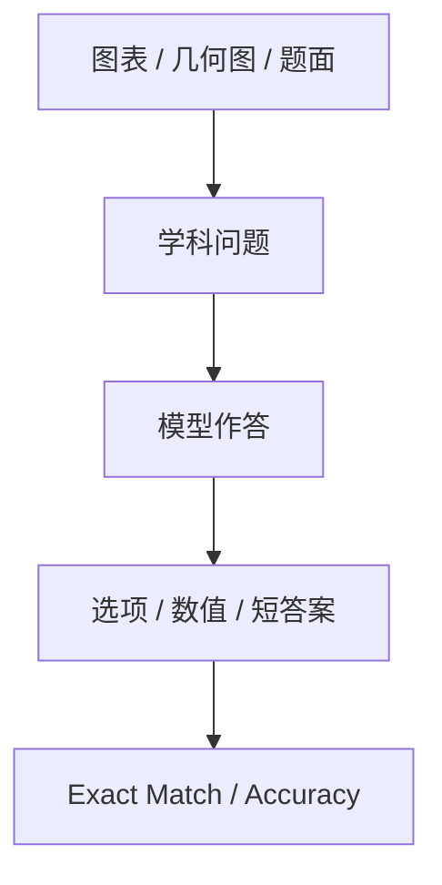

# Benchmark Card: Vision STEM Benchmarks

| 字段 | 值 |
| ---- | ---- |
| 日期 | 2026-05-13 |
| 版本 | v2 |
| 状态 | 已按 6 章节模板重写 |
| 变更记录 | v1 为综述卡；v2 补入示例、规模说明、风险表与 4.1-4.6 展开 |

---

## 1. 一句话定义

这张专题卡覆盖截图里的视觉 STEM benchmark：`MMMU`、`MathVista`、`MMMU-Pro`、`MathVerse_MINI`、`WeMath`、`DynaMath`，主要关注模型在**带图的知识题、数学题与科学推理题**上的能力。

## 2. 快速参考

| 属性 | 值 |
| ---- | ---- |
| 覆盖对象 | `MMMU` / `MathVista` / `MMMU-Pro` / `MathVerse_MINI` / `WeMath` / `DynaMath` |
| 主要能力 | 视觉 STEM / 视觉数学 / 图文学科推理 |
| 常见输入 | 图表、几何图、题面截图、教材图、带图选择题 |
| 常见输出 | 选项、数值答案、短文本答案 |
| 常见评分 | accuracy / exact match |
| 一级类目 | `Vision / Multimodal` |
| 二级类目 | `STEM` |
| 任务形态 | `visual STEM reasoning and math problem solving` |
| 风险标签 | split 混用 / 闭合答案高估能力 / 视觉数学与宽 STEM 混用 |
| 代表来源 | `MMMU` 官方 repo、`MathVista` 项目页及论文、`DynaMath` 论文、`We-Math` 项目页 |

## 3. 卡片导航

### 3.1 核心流程

### 3.2 如果你只看三件事

- `MMMU` 是这组里最常被引用的视觉 STEM 总览卡。
- `MathVista` 更聚焦“看图做数学”，不能和宽口径 `MMMU` 完全等价。
- `MMMU-Pro`、`MathVerse_MINI` 这类名字里自带版本或 split，引用时必须写清。

## 4. 它怎么运作

### 4.1 它到底在测什么

这组 benchmark 主要关注：

1. 模型能否读取学科图像、图表、几何图和题面。
2. 模型能否在视觉条件下调用数学或科学知识。
3. 模型能否从图文联合输入中推导出唯一答案。

组内分工大致是：

- [`MMMU`](#mmmu)：宽口径视觉 STEM
- [`MathVista`](#mathvista)：视觉数学
- [`MMMU-Pro`](#mmmu-pro)：更难的 `MMMU` 家族信号
- [`MathVerse_MINI`](#mathverse-mini)：视觉数学 benchmark 的轻量 split
- [`WeMath`](#wemath)：更偏教育 / 考试风格
- [`DynaMath`](#dynamath)：更偏鲁棒性与题面变化

#### MMMU

`MMMU` 是这组里最常被引用的视觉 STEM 总览 benchmark。

#### MathVista

`MathVista` 更聚焦看图做数学。

#### MMMU-Pro

`MMMU-Pro` 是更强调区分度的强化版信号。

#### MathVerse_MINI

`MathVerse_MINI` 是 `MathVerse` 家族的轻量 split。

#### WeMath

截图里的 `WeMath` 更稳妥地应理解为 `We-Math` 系列口径。它更贴近教育考试场景，但引用时最好写清具体版本。

#### DynaMath

`DynaMath` 是一个明确围绕 visual math robustness 设计的 benchmark，更强调题面变化与鲁棒性。

### 4.2 输入长什么样

输入通常包括：

- 一张或多张题目相关图片
- 一道问题
- 若干选项，或要求输出数值答案

**典型样式示例**：

#### `MMMU` 风格

> 给一张大学教材图表或实验图，问题可能是“根据图中趋势，哪个结论最合理？”  
> 重点是视觉理解和学科知识一起用。

#### `MathVista` 风格

> 给一张几何图或函数图像，问题可能是“阴影面积是多少”或“曲线交点的坐标是什么？”  
> 这里的核心不是通识知识，而是视觉数学推理。

#### `WeMath` / `DynaMath` 风格

> 给一张考试题面截图，题目包含图形、公式和文字说明；模型需要输出数值答案或选项。  
> 这类任务更容易暴露 OCR、视觉理解和数学求解三者之间的短板。

### 4.3 模型要输出什么

输出通常是：

- 选项字母
- 数值答案
- 可抽取的短文本结论

这类 benchmark 的一个工程现实是：

- 最终计分往往只看答案对不对
- 过程推理通常不参与正式评分

### 4.4 数据是怎么做出来的

这组 benchmark 的构造路线大体分三类：

- **宽覆盖视觉 STEM**：`MMMU`
- **视觉数学专项**：`MathVista`、`MathVerse_MINI`
- **更贴近教育或鲁棒性场景**：`We-Math` 系列、`DynaMath`

这意味着它们虽然都在测“带图做题”，但背后的目标并不完全相同。

### 4.5 数据规模与分布

最关键的不是死记每个数字，而是记住各自的功能位：

| 项目 | 更适合记住什么 |
| ---- | ---- |
| `MMMU` | 视觉 STEM 总览入口 |
| `MathVista` | 视觉数学代表 benchmark |
| `MMMU-Pro` | 强化版分层信号 |
| `MathVerse_MINI` | 轻量 split，不等于 full benchmark |
| `WeMath` | 更接近 `We-Math` 系列的教育 / 考试风格补充；报分时应写清版本 |
| `DynaMath` | 更强调题面变化与鲁棒性 |

### 4.6 怎么判分

这组 benchmark 常见评分是：

- `accuracy`
- `exact match`

优势：

- 闭合答案好自动评分
- 适合大规模横向比较

局限：

- 容易高估“最终碰巧答对”的模型
- 低估过程推理质量

## 5. 它可靠吗

### 5.1 它不测什么

- 长视频或动态视觉理解
- 多轮代理工作流
- 开放式科研写作
- 工具调用与检索

所以它更适合解释为：

> 视觉 STEM / 视觉数学 benchmark。

### 5.2 难度信号

这组 benchmark 的难点通常来自三层：

- 图像读取本身
- 学科知识调用
- 最终推理链闭合

其中 `MathVista` 一类题最容易拉开“看图”和“真正会做数学”的差距。

### 5.3 缺陷与争议

#### 5.3.1 🏛️ `MMMU` 不是数学专项 benchmark

它覆盖面很广，所以高分不代表视觉数学就一定强。  
来源：`MMMU` 的宽学科设计定位。

#### 5.3.2 🗣️ `MINI`、`Pro`、动态版本不能混报

这些名字本身就在提示版本或 split 差异，直接横比会失真。  
来源：benchmark 家族命名与版本演进方式。

#### 5.3.3 🗣️ 闭合式评分会放大“最终答案正确”的表面效果

模型可能过程并不稳，但因为输出唯一答案仍能拿分。  
来源：数学与 STEM 闭合答案 benchmark 的通用局限。

### 5.4 风险表

| 风险维度 | 风险级别 | 为什么 | 使用建议 |
| ---- | ---- | ---- | ---- |
| split / 版本混用 | 高 | `Pro`、`MINI`、动态版本口径不同 | 报分时把具体版本写全 |
| 宽 STEM 与数学混用 | 中 | `MMMU` 与 `MathVista` 的能力焦点不同 | 至少分开报告 |
| 闭合答案偏差 | 中 | 只看 final answer 会高估真实推理 | 结合过程类 benchmark 一起看 |
| 现实外推 | 中 | 做题不等于真实科研或真实教学场景 | 与 agent / long-context benchmark 配合 |

## 6. 我该用它吗

### 6.1 适用场景

- 你要看模型是否能“看图做学科题”
- 你要区分通用视觉模型与真正有 STEM 底盘的模型
- 你关心视觉数学、教育数学或带图考试场景

### 6.2 是否值得看

> 这组 benchmark 很值得保留，但正确读法是：`MMMU` 看总览，`MathVista` 看视觉数学，`WeMath` / `DynaMath` 看教育题与鲁棒性，不要把它们压成一个统一结论。

结论标签：`★ 推荐`
