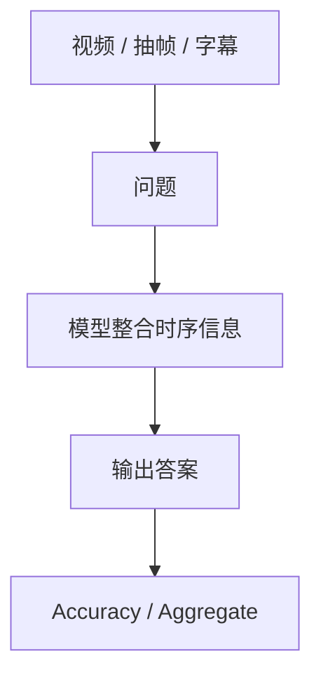

# Benchmark Card: Vision Video Understanding Benchmarks

| 字段 | 值 |
| ---- | ---- |
| 日期 | 2026-05-13 |
| 版本 | v2 |
| 状态 | 已按 6 章节模板重写 |
| 变更记录 | v1 为综述卡；v2 补入示例、指标说明、风险表与完整章节结构 |

---

## 1. 一句话定义

这张专题卡覆盖截图里的视频 benchmark：`Video-MME (w/o subs)`、`LVBench`、`MLVU (M-Avg)`、`LongVideoBench (val)`、`MotionBench`，主要关注模型在**视频理解、长视频记忆、时序推理和运动理解**上的能力。

## 2. 快速参考

| 属性 | 值 |
| ---- | ---- |
| 覆盖对象 | `Video-MME (w/o subs)` / `LVBench` / `MLVU (M-Avg)` / `LongVideoBench (val)` / `MotionBench` |
| 主要能力 | 视频理解 / 长视频理解 / 时序推理 / 运动感知 |
| 常见输入 | 视频、抽帧、问题、可选字幕 |
| 常见输出 | 选项、短答案、自由文本 |
| 常见评分 | accuracy / aggregate score |
| 一级类目 | `Vision / Multimodal` |
| 二级类目 | `Video Understanding` |
| 任务形态 | `video QA and temporal understanding` |
| 风险标签 | 抽帧策略影响大 / 是否带字幕差异大 / 长度与推理混杂 |
| 代表来源 | `Video-MME` 官方项目页及各 benchmark 官方公开资料 |

## 3. 卡片导航

### 3.1 核心流程

### 3.2 如果你只看三件事

- `Video-MME` 是最常被引用的视频总览入口之一；截图里是 `w/o subs` 口径。
- `LVBench`、`LongVideoBench` 更偏长视频，不能和普通短视频问答一视同仁。
- `MLVU (M-Avg)`、`MotionBench` 更适合看多维视频稳定性和运动线索。

## 4. 它怎么运作

### 4.1 它到底在测什么

这组 benchmark 主要关注：

1. 模型能否理解视频内容而不是只看单帧。
2. 模型能否在长时间跨度上保留关键信息。
3. 模型能否处理先后顺序、动作方向、运动变化等时序线索。

#### Video-MME

截图里的 `Video-MME (w/o subs)` 是 `Video-MME` 的无字幕口径。

#### LVBench

`LVBench` 更偏长视频理解。

#### MLVU

截图里的 `MLVU (M-Avg)` 是 `MLVU` 的平均指标视角。

#### LongVideoBench

截图里的 `LongVideoBench (val)` 是验证集口径。

#### MotionBench

`MotionBench` 更聚焦运动与动态变化。

### 4.2 输入长什么样

输入一般包括：

- 一个视频或抽样帧
- 一个问题
- 有时带字幕，有时不带

**典型样式示例**：

#### `Video-MME` 风格

> 给一段短视频，问题可能是“人物最后把物体放在桌上还是柜子里？”  
> 这里重点是跨帧整合，而不是单帧识别。

#### `LongVideoBench` / `LVBench` 风格

> 给一段更长的视频，问题可能问中前段发生的事件与后段结果之间的关系。  
> 难点在于时间跨度大、信息容易遗失。

#### `MotionBench` 风格

> 问题可能是“球最终是向左还是向右滚动？”  
> 这类任务会暴露模型只看静态帧、不理解运动方向的问题。

### 4.3 模型要输出什么

输出通常是：

- 选项
- 短答案
- 自由文本

视频 benchmark 的工程现实是：

- 抽帧方式本身就是评测的一部分
- 字幕是否可用会极大改变结果

### 4.4 数据是怎么做出来的

这组 benchmark 的目标分层比较清楚：

- `Video-MME`：视频总览
- `LVBench` / `LongVideoBench`：长视频
- `MLVU`：多维视频理解
- `MotionBench`：运动与时序变化

所以读分时最好先问：

> 这是短视频理解、长视频记忆，还是运动理解？

### 4.5 数据规模与分布

比起死记规模，更重要的是记住口径：

| 项目 | 更适合记住什么 |
| ---- | ---- |
| `Video-MME (w/o subs)` | 不带字幕的视频总览口径 |
| `LVBench` | 长视频理解 |
| `MLVU (M-Avg)` | 多子任务平均视角 |
| `LongVideoBench (val)` | 验证集口径的长视频 benchmark |
| `MotionBench` | 运动与动态变化 |

### 4.6 怎么判分

这组 benchmark 常见评分是：

- `accuracy`
- aggregate score

优点：

- 适合快速比较视频模型强弱

局限：

- 会被采样帧数、采样策略、字幕使用方式强烈影响

## 5. 它可靠吗

### 5.1 它不测什么

- GUI 操作
- 文档 OCR
- 多图静态整合
- 完整 agent 工作流

所以它更适合解释为：

> 视频理解 benchmark。

### 5.2 难度信号

这组任务的难点通常来自：

- 时间跨度
- 运动线索
- 早期信息记忆
- 字幕缺失时仅靠视觉理解

### 5.3 缺陷与争议

#### 5.3.1 🏛️ 字幕口径不能混

`w/o subs` 与带字幕结果不是同一类能力信号。  
来源：视频 benchmark 协议本身。

#### 5.3.2 🗣️ 长视频分数混合了记忆和推理

低分可能是忘了前面，也可能是不会推理，不能只看一个总分。  
来源：长视频 benchmark 的通用解释问题。

#### 5.3.3 🗣️ 抽帧策略是结果的一部分

不同帧采样预算可能导致显著分差。  
来源：视频模型评测的工程现实。

### 5.4 风险表

| 风险维度 | 风险级别 | 为什么 | 使用建议 |
| ---- | ---- | ---- | ---- |
| 协议混用 | 高 | 是否带字幕、采样方式差异巨大 | 把协议写清楚 |
| 长度与推理混杂 | 高 | 分数可能主要反映记忆容量 | 结合短视频 benchmark 一起看 |
| 平均分误导 | 中 | `M-Avg` 会掩盖子任务差异 | 尽量补充分项结果 |
| 现实外推 | 中 | benchmark 视频仍比真实产品场景干净 | 用真实视频样本补测 |

## 6. 我该用它吗

### 6.1 适用场景

- 你要看视频理解能力
- 你关心长视频、运动或时序推理
- 你不想只用单帧视觉 benchmark 代替视频能力

### 6.2 是否值得看

> 这组 benchmark 值得看，但视频 benchmark 的第一原则是保留协议：字幕、采样、split 不写清楚，分数基本没法解释。

结论标签：`★ 推荐`
