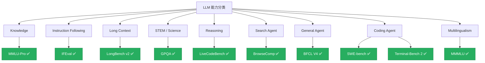

## 项目定位

这是一个面向实际阅读的 benchmark 指南站，目标是为每一个重要的 LLM benchmark 建立一张标准化的**解读卡片**。

每张卡片统一回答 4 个核心问题：

| 问题           | 对应章节 |
| -------------- | -------- |
| 它是什么？     | §1-§2    |
| 它怎么运作？   | §4       |
| 它可靠吗？     | §5       |
| 我该用它吗？   | §6       |

> [!TIP]
> 如果你不确定怎么读这些卡片，可以先看[阅读指南](/zh/guide/how-to-read)。

> [!TIP]
> 如果你更关心“这些结论是怎么取材的”，可以再看[来源方法](/zh/guide/how-we-source)。

## 当前已上线 10 张卡片

| 类目 | 卡片 |
| ---- | ---- |
| Search Agent | [BrowseComp](/zh/cards/search-agent/browsecomp) |
| Coding Agent | [SWE-bench](/zh/cards/coding-agent/swebench), [Terminal-Bench 2](/zh/cards/coding-agent/terminal-bench-2) |
| Knowledge | [MMLU-Pro](/zh/cards/knowledge/mmlu-pro) |
| Instruction Following | [IFEval](/zh/cards/instruction-following/ifeval) |
| Long Context | [LongBench v2](/zh/cards/long-context/longbench-v2) |
| STEM | [GPQA](/zh/cards/stem/gpqa) |
| Reasoning | [LiveCodeBench](/zh/cards/reasoning/livecodebench) |
| General Agent | [BFCL V4](/zh/cards/general-agent/bfcl-v4) |
| Multilingualism | [MMMLU](/zh/cards/multilingualism/mmmlu) |

## 能力分类体系

✅ = 已有卡片
