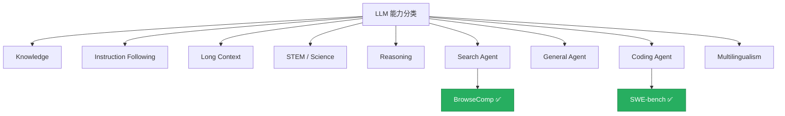

## 项目定位

这是一个面向实际阅读的 benchmark 指南站，目标是为每一个重要的 LLM benchmark 建立一张标准化的**解读卡片**。

每张卡片统一回答 4 个核心问题：

| 问题           | 对应章节 |
| -------------- | -------- |
| 它是什么？     | §1-§2    |
| 它怎么运作？   | §4       |
| 它可靠吗？     | §5       |
| 我该用它吗？   | §6       |

> [!TIP]
> 如果你不确定怎么读这些卡片，可以先看[阅读指南](/zh/guide/how-to-read)。

## 能力分类体系

✅ = 已有卡片 &nbsp;|&nbsp; 其余类目陆续上线
